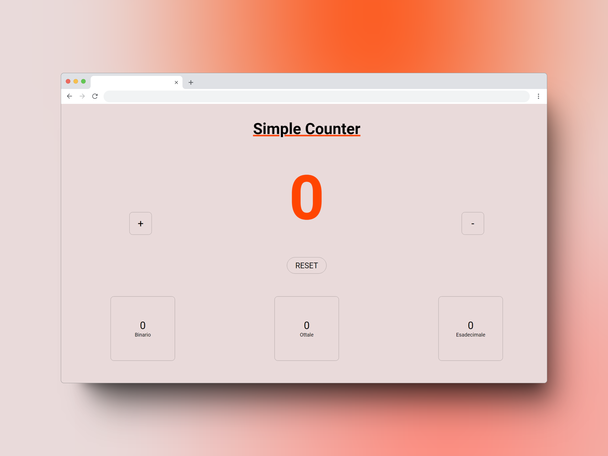

# Javascript Simple Counter
Un normalissimo counter Javascript, un po' più nerd

## Link utili:
- [About](#di-cosa-si-tratta)
- [Linnk al sito](#come-provarlo)
- [Strumenti](#strumenti-utilizzati)

## Di cosa si tratta?
Come dice il nome è un semplice counter sviluppato con Javascript, per dargli un po' più di senso ho deciso di aggiungere la conversione del nostro numero in base binaria, ottale ed esadecimale. 

La sfida proposta dai coach di Start2Impact è quella di creare un counter creando i suoi elementi con Javascript, per questo motivo all'interno del body di index.html non troverete assolutamente nulla, oltre al tag per in cludere lo script Javascript in cui avvengono le magie.

## Come provarlo? 
Ti basterà collegarti a [questo sito](https://s2i-ilpiova-simple-counter.netlify.app/) e iniziare a contare

## Strumenti utilizzati:
- HTML
- CSS
- JAVASCRIPT